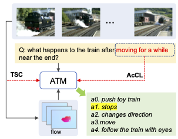

# [ATM: Action Temporality Modeling for Video Question Answering](https://arxiv.org/pdf/2309.02290.pdf)
This is an official implementation of our paper accepted to ACM Multimedia'2023: ATM: Action Temporality Modeling for Video Question Answering


<div align="center">
  
</div>


# Get Started
The code is mainly developed from [VGT](https://github.com/sail-sg/VGT). Thanks the authors for the great work and code.

## Environment
Assume you have installed Anaconda, please do the following to setup the envs:
```
>conda create -n videoqa python==3.8
>conda activate videoqa
>pip install -r requirements.txt
```

## Data Preparation

Create the data annotation folder inside ```data/```. Download the csv files from [annotations](https://drive.google.com/drive/folders/1l8bx3o1uhChH0MnDKDoRVxTgHaveOk2x?usp=sharing) into ```data/dataset/nextqa```.
Download the folders from [features](https://drive.google.com/drive/folders/1NoNIW9b_obtAxgj7bwihOyoNTZk6rtqk?usp=sharing) into ```data/features/nextqa'''.
Donwload the checkpoints into ```data/save_models/nextqa/```.

# Scripts

## Inference
```
sh ./shell/next_test.sh 0
```
## Pretrain
```
sh ./shells/next_train.sh 0
``` 

## Finetune
```
sh ./shells/next_ft.sh 0
``` 


# Citation 
```
@article{chen2023atm,
	  title={ATM: Action Temporality Modeling for Video Question Answering},
	  author={Chen, Junwen and Zhu, Jie and Kong, Yu},
	  journal={ACM Multimedia},
	  year={2023}
}
```

